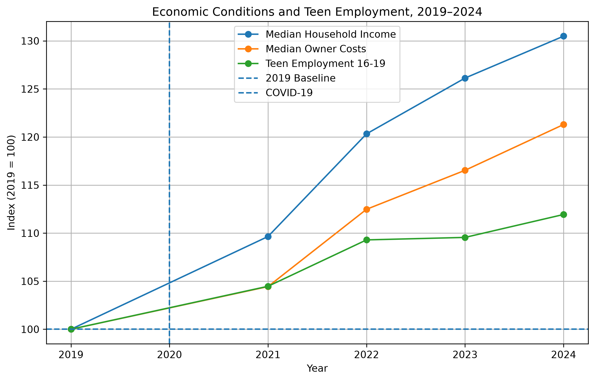

# Josiah Bradshaw

<a href="index.md" class="home-link">Home</a>

<a href="aboutme.md">About Me</a>
<a href="projects.md">Projects</a>
<a href="blog.md">Blog</a>
<a href="links.md">Links</a>

<h3>Data Science Student | UNC Charlotte</h3>

Welcome to my Data Science portfolio.

I'm a returning student at UNC Charlotte pursuing a degree in Data Science. This portfolio documents my coursework, projects, and growth throughout my studies.

I'm particularly interested in using data to explore real-world problems, find meaningful patterns, and communicate insights through analysis and visualization.

---

## Featured Projects

