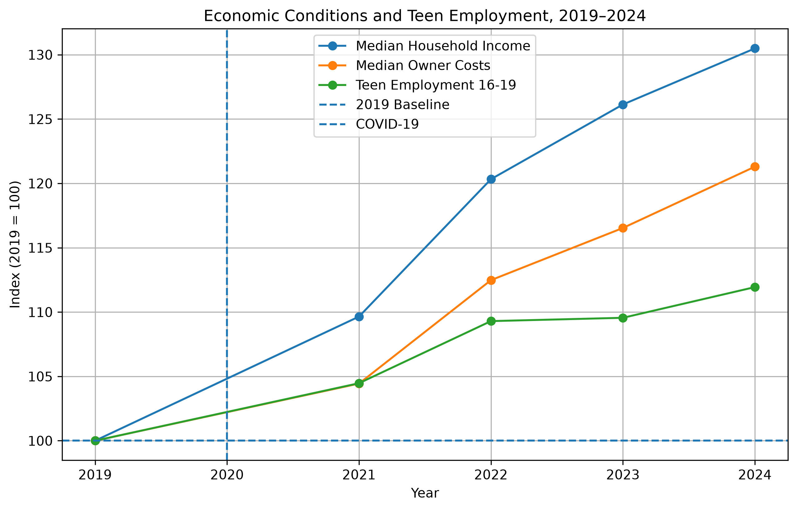
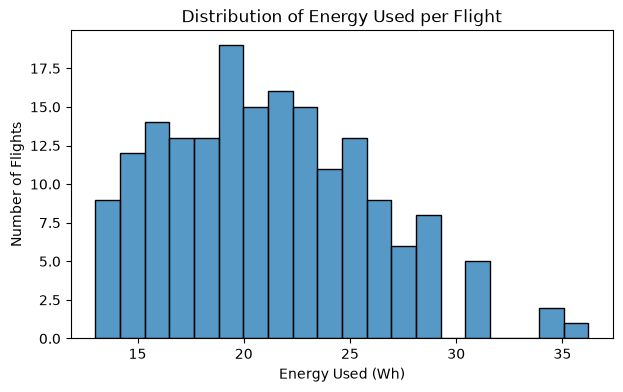

---
---

# [Josiah Bradshaw](index.md){: .site-title}

<a href="assets/resume.pdf" download>
  Resume 
  Download
</a>

<a href="https://github.com/MassSarcasm" target="_blank">
  GitHub 
  Link
</a>

<a href="https://www.linkedin.com/in/josiahbradshaw/" target="_blank">
  LinkedIn 
  Link
</a>

<a href="index.html" class="active-home">Home</a>
<a href="aboutme">About Me</a>
<a href="projects">Projects</a>
<a href="blog">Blog</a>
<a href="links">Links</a>

---

### Data Science Student | UNC Charlotte

Welcome to my Data Science portfolio.

I'm a returning student at UNC Charlotte pursuing a degree in Data Science. This portfolio documents my coursework, projects, and growth throughout my studies.

I'm particularly interested in using data to explore real-world problems, find meaningful patterns, and communicate insights through analysis and visualization.

---

## Featured Projects

  

    <a href="projectsall/project2attend" class="project-link">
      Post Covid-19 High School Attendance Analysis
      Click Here to View Project
    </a>

    

  

  

    <a href="projectsall/project4drones" class="project-link">
      Drone Analysis Prediction Model Project
      Click Here to View Project
    </a>

    

  

